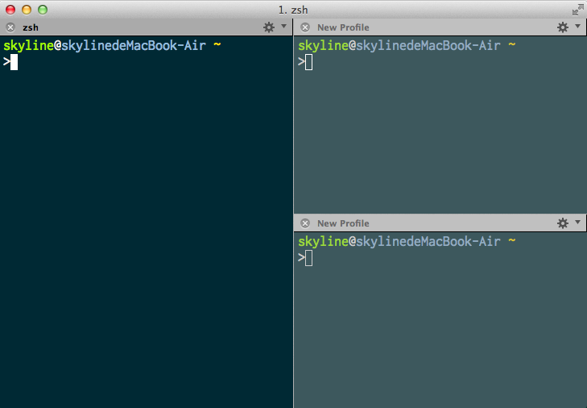
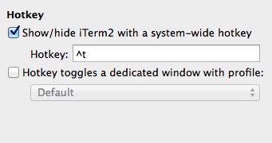
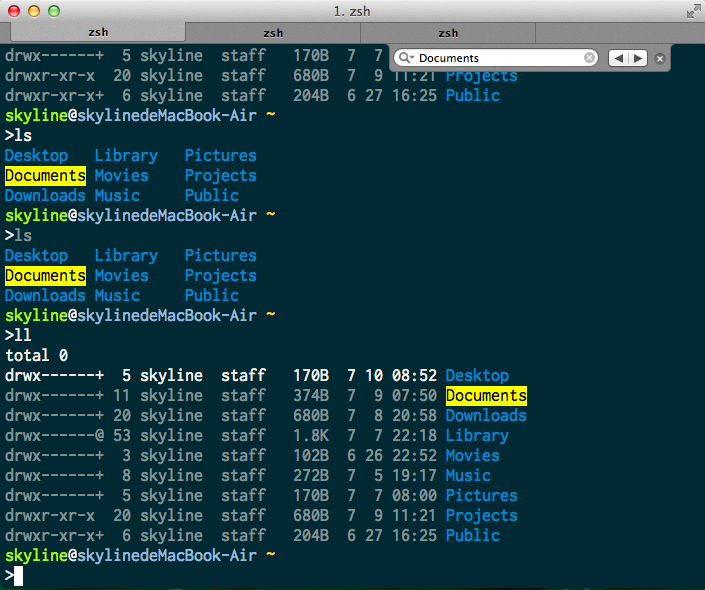
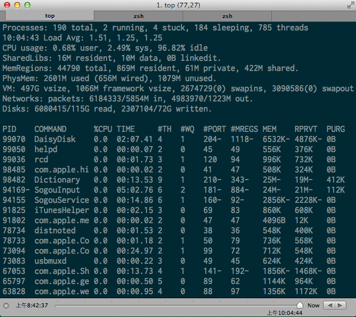

iTerm2新手技巧
===============

以前用Linux时只用过Gnome Terminal之类的终端模拟器，很喜欢它的标签页功能，觉得对工作效率提升特别有帮助。当时感觉像Guake那种下拉式终端，同时还支持标签页等功能，已经很炫酷了。直到我遇见了iTerm2，不夸张的说，我真的被它强大的功能震惊了。这货简直把终端的玩法提升到了一个新高度。废话少说，来看看它有哪些给力的使用技巧。

### 快捷键

#### 窗口操作

* **新建窗口**：Command + N
* **关闭窗口**：Shift + Command + W
* **窗口之间切换**
     * **前一个窗口**： Command + `
     * **后一个窗口**：Command + ~ 
     * **进入窗口1，2，3...**： Option + Command + 窗口编号

#### 标签页操作

* **新建标签页**：Command + T
* **关闭标签页**： Command + W
* **标签页之间切换**
    * **前一个标签页**： Command + 左方向键，Shift + Command + [ 
    * **后一个标签页**： Command + 右方向键，Shitf + Command + ]
    * **进入标签页1，2，3...**：  Command + 标签页编号
* **Expose 标签页**： Option + Command + E（将标签页打撒到全屏，并可以全局搜索所有的标签页）

#### 面板操作

* **垂直分割** Command + D
* **水平分割** Shift + Command + D
* **面板之间切换** 
    * **前一个面板**： Command + [
    * **后一个面板**： Command + ]
    * **切换到上/下/左/右面板**：Option + Command + 上下左右方向键

有了面板分割功能，你可以把终端搞成这样：

看起来很像是Vim的分屏功能，但是使用范围更广了。

#### 其他操作
* **支持自定义全局快捷键用于显示和隐藏iTerm2**   

* **进入和退出全屏**：Command + Enter
* **查看当前终端中光标的位置**：Command + /
* **命令自动补全**：Command + ;（很少用这个，还是感觉Zsh的补全更好用）
* **开启和关闭背景半透明**：Command + u
* **清屏（重置当前终端）**：Command + r

### 特色功能

#### 文本选取

文本选取有**使用鼠标**和**不使用鼠标**两种方式。

**使用鼠标**：默认情况下，选取的文字会自动复制到剪切板，可以使用以下方式进行文本选取：

* 常见的点击并拖拽方式
* 双击选取整个单词
* 三击选取整行
* 选取某一部分，按住Shift，再点击某处，可以选取整个矩形内的文本（类似Windows下按住Shift可以批量选取图标）
* 按住Command + Option，可以用鼠标画出一个矩形，用类似截图的方式选取文本

另外，还可以使用鼠标完成以下操作：

* 按住Command然后点击某个URL，会在浏览器中打开这个URL，点击某个文件夹，会在Finder里打开这个文件夹（再也不用open . 啦），点击某个文件名，会打开这个文件（文本文件支持MacVim，TextMate和BBEdit，如果后面跟随一个冒号和行号，文件会在行号处打开，其它格式的文件似乎不能调用默认程序打开）
* 选取文本之后，按住Command 同时拖动文本，可以将文本粘贴到目标位置（Drag and Drop）
* 鼠标中键粘贴（这个太感人了，一下子找回Linux的感觉了）

**不使用鼠标**：(这种方式最多只能选取一行文本) 使用 Command + f，会呼出一个搜索框，可以在当前面板中进行搜索，输入想要选取的部分内容，输入过程中，按Tab可以将选取部分向右扩展，按Shift + Tab向左扩展，按回车转到下一个匹配位置。使用Tab或Shift+Tab扩展得到想要的内容之后，选取内容会自动复制到剪切板，再次按Command + f隐藏搜索框。

此外，点击搜索框最左边的放大镜按钮，可以选择搜索匹配方式（忽略大小写和正则表达式）。

#### 位置书签
 
在当前会话中按Command + Shift + m可以保存当前位置，之后可以按Command + Shift + j跳回这个位置。

#### 粘贴历史

使用Command + Shift + h 可以呼出粘贴历史，支持模糊检索。还可以设置将粘贴历史保存在磁盘上（Preferences -> General）

#### 即时回放

使用 Command + Opt + b 打开即时回放，按Esc退出。即时回放可以记录终端输出的状态，让你“穿越时间”查看终端内容。默认每个会话最多储存4MB的内容，可以在设置中更改（Preferences -> Genernal -> Instant Replay）。

#### 窗口状态

通过 Window -> Save Window Arrangement 可以保存当前窗口状态的快照，包括打开的窗口，标签页和面板。通过 Window -> Restore Window Arrangement 还原。还可以在 Preferences -> General -> Open saved window arrangement 中设置在启动iTerm2时自动恢复窗口状态

### 总结

看了这么多，想必你对iTerm2的强大功能已经有所了解。iTerm2的功能远不是一篇文章能介绍完的，有兴趣的可以去查看它的官方文档。我也是一边学习，一边完成了这篇博文。

外有iTerm2强大的会话管理，内有Zsh各种爽快的跳转和补全，妈妈再也不用担心我的终端不好用啦！
 
